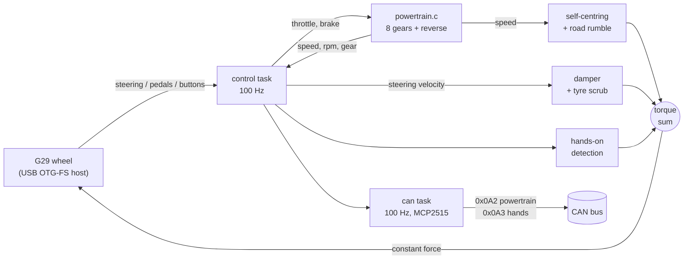

# G29 Force Feedback — STM32 BlackPill (native USB host)

Drive a Logitech **G29 Driving Force** directly from a WeAct BlackPill
**STM32F401CEU6** — read steering/pedals/buttons and send force feedback — with
**no PC and no MAX3421E**. The F401's USB OTG-FS peripheral acts as the USB host.

> Target is the **F401CE (84 MHz max)**. The clock config in `board.c` is
> F401-specific (84 MHz core, 48 MHz USB). For an F411 board, change the PLL to
> `N=192, P=/2, Q=4` (96 MHz) and `FLASH_LATENCY_3`, and set `board = blackpill_f411ce`.

Built with **PlatformIO + STM32Cube HAL**. Ported from the Zephyr version
(`~/zephyrproject/workspace/g29-zephyr`), which needed an external MAX3421E
because Zephyr has no STM32 USB-host driver. STM32Cube does, so this is simpler
hardware.

---

## What this actually does

Three jobs, all on one 84 MHz MCU with no PC involved:

1. **Reads the wheel** over native USB host — steering, pedals, buttons.
2. **Simulates a car** from the pedals: engine + 8-speed automatic + reverse.
   Vehicle speed is the primary state; engine RPM is a *consequence* of speed and
   gear ratio, the way a real ECU derives it.
3. **Renders steering feel back** as force feedback — tyre scrub, viscous
   damping, speed-dependent self-centring, road rumble — and infers whether the
   driver's hands are on the wheel. Everything is broadcast on CAN so the board
   behaves like a real automotive node.



The single most important structural fact: **in C294 compat mode the wheel gives
exactly one force-feedback channel** (constant force). Every effect above is
summed into that one 16-bit number, which is why they interact and why the
suppression rules in [`src/steer_feel.c`](src/steer_feel.c) exist.

## Quick start

```bash
# PlatformIO 6.x — the apt 'pio' 4.3.4 is broken on this machine
~/.platformio/penv/bin/pio run                        # build
~/.platformio/penv/bin/pio run -t upload              # flash via ST-Link
~/.platformio/penv/bin/pio device monitor -b 115200   # serial console
```

The powertrain model is pure integer maths with no HAL dependency, so it builds
and self-checks on the host — do this before touching a board:

```bash
gcc -Wall -Wextra -std=c99 -I include \
    src/powertrain.c test/test_powertrain.c -o /tmp/pt && /tmp/pt
```

Once running, type `?` in the console for the live knob list. A normal log line:

```
steer=+104 thr=  0 brk=  0 btn=00000000 vel=   -2 force= -1810 ctr= -2776 \
p2p=    0 hands=1 gear=D6 rpm=3425 spd=137 cpu=12.4% ffb[ok=5528 nak=0 err=0]
```

| Field | Meaning |
|-------|---------|
| `steer=` | wheel angle in degrees, scaled by `steer_range` (`±450` at 900°) |
| `thr=` `brk=` | pedals, 0–255 |
| `vel=` | steering velocity, widened counts per 50 ms window |
| `force=` | **total** torque sent to the wheel, after clamping |
| `ctr=` | the self-centring component alone (for tuning `C`/`x`) |
| `p2p=` | last hands-on probe excursion |
| `hands=` | 1 = hands on wheel |
| `gear=` | `D1`–`D8` or `R0` |
| `rpm=` `spd=` | simulated engine RPM and km/h |
| `cpu=` | CPU load **averaged over the interval since the previous log line**, from the idle task's share of DWT cycles |
| `ffb[ok=…]` | FFB reports confirmed delivered / NAKed / errored |

## Where to look

| I want to… | Go to |
|---|---|
| understand the car model | [`src/powertrain.c`](src/powertrain.c), [Powertrain simulation](#powertrain-simulation) |
| see the module layout | [File map](#file-map) |
| change how the steering *feels* | `car_*` tunables in [`src/steer_feel.c`](src/steer_feel.c), [Speed-dependent steering feel](#speed-dependent-steering-feel) |
| tune without reflashing | [Serial console](#serial-console) |
| add or change a CAN frame | `can_task()` in [`src/main.c`](src/main.c), [Frames](#frames) |
| work on the USB protocol | [`src/g29_hid.c`](src/g29_hid.c), [Which FFB effects actually work](#which-ffb-effects-actually-work-in-c294) |
| know why the torque gains are what they are | [Identified plant](#identified-plant-system-id-not-guesswork) |

## Read this before changing anything

Non-obvious things that have already cost debugging time. Each is documented in
full further down; these are the one-line versions.

| # | Gotcha |
|---|--------|
| 1 | **There is no FFB queue.** `queue_ffb()` is a *single slot* that overwrites unconditionally. Two writers in the same 10 ms window means one report is silently destroyed — this is what broke the range command. [→](#wheel-setup-why-the-range-came-up-only-sometimes-fixed) |
| 2 | **Delivery ≠ acceptance.** The wheel acks a range command with `USBH_URB_DONE` and then ignores it if it arrives too soon after enumeration. Hence the re-assert loop. [→](#and-a-second-cause-acked-but-ignored) |
| 3 | **Stiction is 10.4 % of full scale** (3401 units). Any torque below that moves the wheel *not at all*, which is why a physically correct spring felt like nothing. [→](#a-linear-spring-alone-does-not-work-here--stiction-compensation-x) |
| 4 | **`vel_to_deg_s()` returns a nominal unit, not real degrees.** It assumes 360° travel; the wheel is 900°. It is self-consistent with the identified gains, so *do not* "fix" it alone. [→](#identified-plant-system-id-not-guesswork) |
| 5 | **Thresholds in counts are range-dependent.** At 900° one 8-bit count is 3.5°, five times coarser than at 180°. `hod_free_counts` in counts means a 5× bigger physical nudge. [→](#unlocking-the-range-made-the-nudge-5-bigger) |
| 6 | **Steering is 8-bit, and throttle+brake share one axis** in C294 — pressing both cancels, and clutch reads 0 always. Descriptor limitation, not a bug. [→](#wheel-mode-this-unit-runs-in-c294-not-c24f) |
| 7 | **The wheel's own centring spring is ON at power-up** and must be switched off with `autocenter(0,0)`, or it fights everything. Strength 0 means *de-activate*, not "coefficient 0". |
| 8 | **VBUS must come from an external 5 V supply.** The BlackPill cannot source the wheel's ~400 mA. [→](#wiring) |

## Verification status

Honest accounting, since some of this is only checkable with a hand on the wheel:

| Verified on hardware | Not independently verified |
|---|---|
| Powertrain shifting under real pedal input (`D2 spd=87` → `D6 spd=137`) | How the current `C`/`x` centring values *feel* |
| Self-centring magnitude and sign vs. predicted (`ctr=+3341` vs 3333 predicted) | Whether the rumble amplitude is pleasant |
| Zero centring at standstill, scaling with speed | Long-run stability of the stiction compensation |
| Range command delivery confirmed by ack counter | |
| Full 900° travel reached at the wheel | |
| Powertrain maths — host self-check, 40+ asserts | |

> One methodological warning, because it produced a wrong conclusion during
> development: **do not verify a hardware claim with a number the firmware
> derived from a constant you just set.** `steer=±450` at the stops proves only
> that the position byte saturated — it reads ±450 whether the wheel turned 900°
> or 180°. Ask whether the reading would look different if the claim were false.

## Why a custom USB class

ST's stock HID class driver (`usbh_hid.c`) **rejects any HID interface that
isn't a boot-protocol mouse or keyboard** — a wheel is neither, so it never
initializes. This project skips ST's HID class entirely and implements a small
custom `USBH_ClassTypeDef` in [`src/g29_hid.c`](src/g29_hid.c) that:

- matches the HID interface (class 0x03, any subclass/protocol),
- opens the interrupt-IN pipe and polls input reports,
- opens the interrupt-OUT pipe and sends force-feedback reports.

Only the generic **USB Host Core** (`usbh_core/ctlreq/ioreq/pipes`) is pulled
from the framework — see [`scripts/usb_host_middleware.py`](scripts/usb_host_middleware.py).

## Wiring

The OTG-FS data pins are fixed by the silicon. Connect them to a **USB-A female**
socket and power that socket's VBUS from an **external 5 V supply**:

| BlackPill | USB-A socket | Note |
|-----------|--------------|------|
| PA12      | D+           | OTG-FS, AF10 |
| PA11      | D−           | OTG-FS, AF10 |
| GND       | GND          | common ground |
| —         | VBUS (+5 V)  | **external 5 V**, ≥ 500 mA |

Console: **USART1 on PA9 (TX) / PA10 (RX)**, 115200 8N1. Adapter RX → PA9,
adapter TX → PA10, GND→GND. RX is what makes the tuning console below work.
Status LED: **PC13** — blinks while waiting, solid when the wheel is ready.

## FreeRTOS

Four tasks, all of which block, so nothing starves:

| Prio | Task | Period | Job |
|------|------|--------|-----|
| 4 | `control` | 10 ms | torque, car feel, hands-on. Highest: a late torque update is the one thing actually felt. |
| 3 | `usb` | 1 ms | services the host stack |
| 2 | `can` | 10 ms | cyclic frames out, FFB frames in |
| 1 | `console` | 5 ms | drains the log ring, parses commands |

`k` reports live stack headroom and free heap — check it before adding tasks
rather than guessing at stack sizes. Currently ~400 words spare per task and
12 KB of 20 KB heap free; the image uses 26 KB of the part's 64 KB RAM.

Four things about this port are load-bearing:

- **`USBH_USE_OS` stays 0.** The G29 class polls URB state
  ([`src/g29_hid.c`](src/g29_hid.c)), so the core must be serviced continuously.
  Under the stack's own RTOS mode it would block on a message queue and the
  class would never advance. The `usb` task calls it on a 1 ms tick instead —
  ample against a 10 ms report interval.
- **SysTick is not handed to FreeRTOS.** Every timing decision here, including
  the step-response fit the car-feel model came from, is written against
  `HAL_GetTick()`. `SysTick_Handler` drives `HAL_IncTick()` *and* the kernel
  tick, both at 1 kHz, so the two clocks stay the same millisecond.
- **`printf` no longer blocks.** It used to call
  `HAL_UART_Transmit(..., HAL_MAX_DELAY)`; at 115200 the ~105-char status line
  takes **~9.1 ms**, nearly a whole control period. It now writes to a ring
  buffer and the console task does the waiting. Overflow drops characters — a
  lost log line is cosmetic, a missed control period is not.
- **Serial RX is interrupt-driven.** The F4 USART has a one-byte receive
  register and no FIFO, so at 115200 a byte lands every 87 µs. Polling it from
  a 5 ms task loses all but the last byte of every command and latches the
  overrun flag. The old kHz main loop got away with polling; a task cannot.

The FPU flags in [`platformio.ini`](platformio.ini) are required, not optional:
the ARM_CM4F port saves FPU registers on context switch and will not assemble
without them, and they have to reach the linker too (done in
[`scripts/usb_host_middleware.py`](scripts/usb_host_middleware.py)) or the link
fails with "uses VFP register arguments".

## Serial console

Interrupt-driven RX, drained by the console task. Tuning force feedback takes
dozens of iterations and reflashing for each one is the slow way.

| Command | Meaning |
|---------|---------|
| `c <n>` | tyre-scrub torque (car feel) |
| `b <n>` | viscous damping, ×10 units per °/s (`138` = 1.0× measured natural) |
| `C <n>` | self-centring torque at full lock, scales with speed (`0` = off) |
| `x <n>` | stiction compensation — lifts the spring over breakaway so it *returns* (`0` = off) |
| `u <n>` | road-rumble amplitude, scales with speed (`0` = off) |
| `e <n>` | sgn() blend width in °/s |
| `t <n>` | probe torque |
| `v <n>` | velocity deadband |
| `p <n>` / `i <n>` / `r <n>` | probe length / interval / ramp, ms |
| `a <n>` | release time when a probe is cut short |
| `y <n>` / `m <n>` | idle time before probing / steering-input threshold |
| `o <n>` | over-speed % of free-wheel speed that means a hand is driving |
| `n <n>` | probes that must agree before the state flips |
| `h <n>` | hands-on threshold |
| `S` | run the step-response identification, CSV to serial |
| `k` | task stack headroom and free heap |
| `f <7 hex>` | send a raw FFB report, e.g. `f 11 00 ff 80 00 00 00` |
| `g <0\|1>` | powertrain direction request, Drive/Reverse (engages once stopped) |
| `R <n>` | lock-to-lock range in degrees, 40–900 (also fixes the `steer=` scale) |
| `s` | stop all effects |
| `q` | mute/unmute the periodic log |
| `?` | show current values |

`f` is the useful one for protocol work — it pokes any Logitech FFB report at
the wheel without a rebuild.

## Wheel mode: this unit runs in C294, not C24F

The README used to claim PS3 mode enumerates as `C24F`. **On this wheel it does
not** — it comes up as `046D:C294`, the "Driving Force" compatibility
descriptor, and every attempt to switch it failed:

| Sent | Result |
|------|--------|
| `f8 13` alone | URB completes, no detach, stays C294 |
| `f8 09 00 **00** 00` + `f8 13` | no detach either |
| `f8 09 00 **01** 00` | detaches immediately, **always** returns as C294 |

So `G29_DO_MODE_SWITCH` is **0**. Re-enabling it just produces an endless
detach/re-enumerate loop every ~0.8 s.

Consequences of running in C294:

- **Steering is 8-bit** (`d[3]`), ~3.5° per count over the wheel's **900°** travel.
  It is widened to 16-bit for the rest of the code, so **one physical count is
  257 widened counts** — every gain is scaled accordingly and must be retuned by
  ~257x if the wheel ever reaches native mode.

  > **Full 900° lock-to-lock does work in C294** — the `f8 81` range command is
  > honoured even in compat mode. It was never a protocol or mechanical limit;
  > the command was simply being *destroyed before delivery* most of the time.
  > See [Why the range came up only sometimes](#why-the-range-came-up-only-sometimes-fixed).
  > Confirmed at the wheel after the fix.
  >
  > **Methodology note, because this cost a wrong conclusion:** do not read a
  > saturated `steer=` as proof of travel. The byte spans 0–255 across whatever
  > the travel happens to be, and the log scales that to `±steer_range/2` — so
  > it prints ±450 at the stops *whenever the byte saturates*, however far the
  > wheel actually turned. Confirming range means turning the wheel and
  > observing the rotation, not reading the number the firmware derived from a
  > scale you set yourself.
  >
  > At 900° over 8 bits the resolution is **3.5° per count**, 2.5× coarser than
  > the old 360° assumption. `vel_to_deg_s()` still uses the 360° constant on
  > purpose — see the caution comment on it. Its output is a *nominal* unit the
  > step-response identification was fitted through, so the factor cancels;
  > changing it alone would detune the damper and break the hands-on overspeed
  > test.
- **Throttle and brake share ONE axis** at `d[4]`: 0x7F neutral, falling for
  throttle, rising for brake. `d[5]` and `d[6]` sit at 0x7F permanently and
  carry nothing. Verified over a live capture — `d[4]` showed 62 distinct values
  while `d[5]`/`d[6]` never moved. Consequences: pressing both pedals **cancels**,
  so overlap cannot be detected, and **clutch has no signal at all** (reports 0).
- Bytes 16+ of the input report are the wheel **echoing back the last FFB
  report** we sent it — handy confirmation that commands arrive.

### Which FFB effects actually work in C294

Measured by holding each effect and watching the steering excursion
(`FFB_SWEEP` in `src/main.c` re-runs this):

| Effect | Command | Moved |
|--------|---------|-------|
| constant, full − | `11 00 00 80 00` | **207 counts** |
| variable, full + | `11 08 ff 80 00` | **164 counts** |
| constant, full + | `11 00 ff 80 00` | **132 counts** |
| spring | `11 01 …` | 47 |
| autocenter activate | `14 00 …` | 23 |
| damper | `11 02 …` | **0 — unsupported** |
| hi-res spring / hi-res damper | `11 0b` / `11 0c` | **0 — unsupported** |

Constant force works fine. The reason it appeared dead for so long was
amplitude: ±2500 of 32767 is level `0x76`–`0x89`, ten steps either side of
neutral, **below the wheel's stiction**. It needs roughly a quarter of full
scale to break away.

Because the wheel's own damper effect is unsupported here, the resistance is
computed in firmware from the steering velocity instead.

> **VBUS is the #1 gotcha.** The BlackPill cannot source the wheel's ~400 mA.
> Feed the USB-A VBUS from a phone charger / bench supply and tie its ground to
> the BlackPill ground. The F401 provides only D+/D−.

## Wheel setup: why the range came up only *sometimes* (fixed)

Symptom: lock-to-lock was narrow on most boots, occasionally full. Intermittency
ruled out a mechanical limit and pointed at delivery — a wheel that is
mechanically capped cannot occasionally give you 900°.

`queue_ffb()` in [`src/g29_hid.c`](src/g29_hid.c) is a **single slot that
overwrites unconditionally** — there is no queue:

```c
memcpy(g29.ffb_buf, cmd, sizeof(g29.ffb_buf));
g29.ffb_pending = true;
```

Setup used to advance on a fixed 50 ms timer. Whenever the range command's
interrupt-OUT transfer hadn't completed inside that window, the *next* setup
step overwrote and destroyed it — and once the 100 Hz torque loop starts it
rewrites that slot every 10 ms, so the range never got another chance. Whether
it survived depended on the USB pipe winning a race, hence "sometimes".

Setup is now **ack-gated**: a step is retired only when `g29_ffb_stats()`'s
`sent` counter advances, which happens on `USBH_URB_DONE` — proof the report
reached the wheel. A 150 ms settle precedes the first command, a 500 ms timeout
stops a wedged endpoint stalling setup, and steps that send nothing (the
trailing settle step) are not gated at all. The console prints
`wheel setup done: range=... delivered to the wheel`, or a warning naming the
step that went unacked.

> `R <n>` deliberately does **not** call `g29_send_range()` directly — that
> would drop the report into the same contended slot and be clobbered just as
> often. It sets the value and replays the ack-gated sequence.

The same race applied to `g29_send_autocenter(0, 0)`, so the default centring
spring could also silently survive a boot — fixed by the same gate.

### ...and a second cause: acked but ignored

Fixing delivery was not enough. With the gate in place a cold boot still logged

```
wheel setup done: range=900 deg delivered to the wheel
```

— no unacked warning, `USBH_URB_DONE` confirmed — and the wheel **still** kept
its narrow travel. So the endpoint accepts the report and the wheel's own FFB
engine then ignores it: an early range command is acked and dropped. A range
command sent a couple of seconds later sticks.

There is no way to read the range back from the wheel, so the fix is to say it
again once the wheel has definitely finished waking up:

- `SETUP_SETTLE_MS` raised to **600 ms** before the first command,
- the sequence is **re-asserted `SETUP_REASSERTS` (4) times at 2 s intervals**
  after start-up, and on every re-enumeration,
- the range is now sent **last** in the sequence, so if any earlier command
  resets it as a side effect, the range is what survives.

Each re-send costs one 10 ms torque update — imperceptible. The console prints
`re-asserting range=900 (n left)` so the passes are visible.

> Diagnostic worth keeping: *delivery confirmed* and *setting honoured* are
> different claims. The ack gate can only ever prove the first.


## CAN (MCP2515 over SPI)

The wheel state is broadcast on CAN and force feedback is accepted from it, so
the board behaves like a real automotive sensor node — cyclic broadcast of small
fixed-layout frames, the way a steering-angle sensor talks to an ESP/EPS.

**The F401 has no bxCAN peripheral**, so the MCP2515 isn't a shortcut here, it's
the only route to CAN on this chip. (F405/F446 have CAN built in.)

| BlackPill | MCP2515 |
|-----------|---------|
| PA5 | SCK |
| PA6 | MISO (SO) |
| PA7 | MOSI (SI) |
| PA4 | CS |
| PB0 | INT |

> **Logic levels.** MCP2515 VIH = 0.7×VDD. At VDD = 5 V that's 3.5 V and the
> STM32's 3.3 V output is out of spec — works cold, fails warm. Power the
> MCP2515 at 3.3 V (its transceiver may still need 5 V) or level-shift.

500 kbps, standard 11-bit IDs. Two knobs at the top of
[`src/mcp2515.c`](src/mcp2515.c): `MCP_XTAL_8MHZ` (read the crystal marking) and
`MCP_LOOPBACK` (receive your own frames, for testing RX with no peer).

### Frames

**TX `0x0A2`** — simulated powertrain state, DLC 8, every 10 ms (and immediately
on a hands-on/off change). Built in [`src/telemetry.c`](src/telemetry.c); see
[Powertrain simulation](#powertrain-simulation) below:

| Byte | Field |
|------|-------|
| 0–1 | engine RPM, uint16 LE |
| 2 | vehicle speed, km/h, **uint8** (magnitude; direction is the mode letter) |
| 3 | gear mode, ASCII — `'P'`, `'N'`, `'D'` or `'R'` |
| 4 | gear number — `0` in reverse/neutral, `1..8` in Drive |
| 5 | hands-on flag (0 = off, 1 = on) |
| 6 | reserved, always `0x00` |
| 7 | rolling counter (staleness detection) |

> Speed is **one byte**, so the frame cannot express more than 255 km/h. It was
> previously clamped to `174` — a stale figure left over from an older gear
> ladder's top speed — which flat-lined the CAN speed at 174 while the serial
> console kept reporting the true 190+. Clamp to the encoding's limit, never to
> whatever the model currently tops out at.

**TX `0x0A3`** — hands-on/off, DLC 1, on change + 100 ms heartbeat (byte 0,
bit 0 = hands on wheel).

**RX `0x0B0`** — FFB command, DLC 3, dispatched on byte 0:

| Byte 0 | Effect | Bytes 1–2 |
|--------|--------|-----------|
| 0x00 | no effect | — |
| 0x01 | constant force | int16 LE, −32767…+32767 |
| 0x02 | autocenter | strength 0–15, rate 0–255 |
| 0x03 | range | uint16 LE degrees, 40–900 |

Total bus load ≈ 5 % at 500 kbps. A real HS-CAN sits at 25–50 %.

> A logic analyzer is **not** a bus node — it doesn't ACK, so an unACKed frame
> would retransmit forever. The driver runs in **one-shot mode** (`CANCTRL.OSM`)
> so this doesn't happen. Probe the MCP2515 **TXCAN pin** (single-ended,
> pre-transceiver); a logic analyzer can't read the CANH/CANL differential pair.

## Powertrain simulation

[`src/powertrain.c`](src/powertrain.c) turns the pedals into a simulated
engine + 8-speed automatic gearbox, the same way a real ECU derives RPM from
road speed and gear rather than the other way round. It's pure integer math
with no HAL/RTOS/CAN dependency, so it builds and runs on the host —
[`test/test_powertrain.c`](test/test_powertrain.c) is the self-check (not
part of the firmware build):

```bash
gcc -I include src/powertrain.c test/test_powertrain.c -o /tmp/pt_test && /tmp/pt_test
```

`control_task` calls `powertrain_tick()` every 20 ms (every other 10 ms
control-loop iteration) with the pedals it already reads from the wheel, and
publishes the result for `can_task` (broadcasts it as `0x0A2`) and the
periodic serial log (`gear=`/`rpm=`/`spd=`).

**Flow:** `pedal -> force -> drag -> speed_accum -> speed -> RPM` (through
the current gear ratio). Speed is the primary state; RPM is a consequence of
it, so at a standstill the engine idles at 800 RPM while the "torque
converter" lets the car creep off the line.

- **Throttle** produces wheel force = `throttle% * engine_torque_curve(rpm) *
  gear_ratio * ACCEL_SCALE`, minus aero (`speed²`) and rolling (`speed`)
  drag. WOT from a stop clears 90 km/h in well under 15 s.
- **Brake** decelerates the wheels directly — `brake% * BRAKE_SCALE` — independent
  of gear ratio, unlike engine braking. Tuned for roughly 100 km/h to 0 in
  ~3 s at full pedal. Braking only ever **downshifts** (or holds gear) as RPM falls;
  it never upshifts, which was a real bug caught by the self-check (upshifts
  are gated on `throttle > 0` now — see the comment in `forward_tick()`).
- **8 gears + reverse**: gear ratios taper 4.700:1 (1st) down to 1.120:1
  (8th); throttle-dependent shift points (~2200 RPM light throttle, ~6800 RPM
  WOT) with hysteresis and a 350 ms clutch-slip blend between gears so
  upshifts don't snap the RPM instantly. 7th deliberately breaks the
  progression at 1.600:1 — see the comment on `gear_ratio[]` for why the
  geometric value made 8th almost unreachable. Reverse is a single fixed
  ratio, throttle coupled straight to RPM (low-speed manoeuvring only, no
  gearbox) — and, like a real selector, **only engages once the vehicle is
  stopped**; a direction request while still rolling is ignored until it is.
- **Measured at WOT from a standstill**: 0–100 km/h in ~4.3 s, all eight gears
  reached by ~13 s, settling at a **197 km/h** top speed in 8th. Top speed is a
  force-vs-drag *equilibrium*, so `PT_AERO_DRAG_DIV` is the knob that sets it —
  not the gearing, which pushes it the other way (see the comment there before
  changing either).
- **The rev limiter is real, not just a gauge clamp.** `clamp_rpm()` caps the
  *reported* RPM; the fuel cut in `apply_forward_force()` is what actually stops
  the car pulling past a gear's redline. Without it the model over-revved 1st,
  2nd and 3rd on every WOT upshift — up to 402 RPM past the limiter with the
  tacho showing a steady 7000.
- **Lifting off is not a brake pedal.** Engine braking scales with RPM above
  idle (pumping loss), so it eases as the engine winds down: coasting from
  40 km/h in 1st takes ~13 s, firm at first and gentle at the end. `PT_COAST_MIN`
  floors it so a coast still finishes — the R↔D interlock needs a true zero.
- **Which gears you see depends on throttle, as it should.** Held at WOT the box
  holds each gear to redline; lift off or cruise on light throttle and the early
  (~2200 RPM) shift points walk it up much sooner — 25% throttle reaches 8th at
  under 100 km/h. That spread is the throttle-dependent shift map doing its job,
  not a defect.

### Speed-dependent steering feel

Two effects that only exist once the car is moving, both computed in
`powertrain.c` (they are functions of vehicle speed, so they live with the
speed) and summed onto the same single constant-force channel as the damper:

| Cmd | Knob | Effect |
|-----|------|--------|
| `C` | `car_centre` | self-aligning torque at full lock — sets how *heavy* it feels |
| `x` | `car_stiction` | stiction compensation — sets whether it actually *returns* |
| `u` | `car_rumble` | road-surface rumble amplitude, once up to speed |

**Self-centring** ramps from nothing at a standstill to full at 80 km/h:

```
centre = −car_centre · (offset / full_lock) · min(speed / 80 km/h, 1)
```

This deliberately **reverses the "damper, not a spring" rule** the
parking-speed model was built on — and that reversal is the physically correct
thing to do. A parked car's wheel stays where you leave it (speed 0 → term is
0); a moving car's wheel pulls straight, harder the faster it goes. Verified on
target: at −50° and 118 km/h the log showed `ctr=+3341` against a predicted
3333.

#### A linear spring alone does not work here — stiction compensation (`x`)

Breakaway on this wheel is **3401 = 10.4 % of full scale**, so a spring below
that is simply invisible: the wheel does not move. With `C=12000` over 450° of
lock, self-return needed `12000·off/32768 > 3401`, i.e. **~127° before anything
happened at all** — felt as "weak, and no centring between −90 and +90". No
value of `C` fixes that: returning at 20° needs `C>30000`, which is brutal at
full lock.

So the two jobs are split. `C` sets the **weight**; `x` sets the **breakaway**,
adding `sign(centre)·x` whenever the wheel is off centre:

| angle | `C=12000` linear | `C=16000` + `x=3401` | returns? |
|------:|-----------------:|---------------------:|:--------:|
| 10° | 266 | 355 + 3401 = **3756** | ✅ (was ✗) |
| 20° | 533 | 711 + 3401 = **4112** | ✅ (was ✗) |
| 90° | 2400 | 3200 + 3401 = **6601** | ✅ (was ✗) |
| 450° | 12000 | 16000 + 3401 = 19401 | ✅ |

Dead zone: **127° → ~8°**, which is `CENTRE_DEADBAND` (2.3 physical counts) and
is where it settles instead of hunting across centre.

The boost **fades out with wheel speed** (`STICTION_VEL_REF`): full at rest to
break the wheel loose, gone by ~137°/s. Once sliding, friction is lower and
continuing to shove would overshoot centre and limit-cycle. That taper plus the
deadband is what keeps it stable. `x 0` reverts to the pure linear spring.

**Road rumble** is broadband noise (a road surface *is* broadband — a fixed
tone reads as a motor whine), amplitude ramping to full at 120 km/h, low-passed
to ~8 Hz.

> The control loop runs at **100 Hz, so Nyquist is 50 Hz** and real road
> vibration (mostly 20–200 Hz) is largely *not* renderable here. What this
> produces is a low rumble, not a tyre buzz — that's a sample-rate limit, not a
> tuning one.

> **This reintroduces some gear knock, by construction.** The wheel's backlash
> clacks whenever torque crosses zero — the whole reason the hands-on probe is
> a single-sign ramped pulse rather than a buzz. A rumble crosses zero
> constantly. It's slew-limited to keep the edges soft; if the mechanical
> chatter bothers you, `u 0` turns it off.

Both are **suppressed while a hands-on probe runs**, for the same reason the
tyre-scrub term is: the probe measures the wheel plus the driver's grip, so the
simulated car has to step out of the way. A side benefit is that the probe
stimulus is unchanged from before these effects existed, so **`hod_free_counts`
does not need recalibrating.**

#### The probe used to steal the centring (fixed)

That suppression had an ugly consequence. A probe only fires once the wheel has
been *still* for `hod_idle_ms` — and holding a steady cornering angle is exactly
that. So holding the wheel at an angle armed a probe, which zeroed the centring
torque for up to 1.6 s and made the steering go slack every few seconds.

Fix: **probes are now inhibited whenever the spring can move the wheel unaided**,
and hands-on is read from the spring instead:

> A centring spring strong enough to return the wheel **is already a stimulus.**
> A free wheel walks back toward centre; a held wheel stays at whatever angle
> the hand chose. So at speed there is nothing to inject — the wheel's own
> behaviour over a 400 ms window is the measurement, and the centring never has
> to be interrupted to take it.

#### Unlocking the range made the nudge 5× bigger

Two things went wrong the moment travel went from ~180° to 900°, and both are
the same root cause: **the probe's abort threshold is in counts, not degrees.**

`hod_free_counts` aborts the probe when the excursion crosses it, so it *is*
what decides how far the nudge swings. At 180° one 8-bit count was 0.7°; at 900°
it is **3.5°**. The old `2000` (7.8 real counts) therefore went from a ~5.5°
nudge to a **~27°** one, without a line of code changing.

Worse, the first version of the inhibit above only covered being *off* centre.
Driving straight, the wheel sits inside `CENTRE_DEADBAND`, so `centre_torque` is
0, `centre_can_move` is false — and the probe fired and swung the wheel **while
driving**.

Fixed both ways:

- `hod_free_counts` **2000 → 900** (~3.5 real counts, so a ~12° nudge), still
  clearing a held wheel's ~1 count by 3–4×.
- Probing is inhibited outright above `PROBE_INHIBIT_KMH` (3 km/h), not just
  when off centre. **A moving car is never nudged.**
- `hod_period_ms` **3000 → 8000**, since probes now only happen at a standstill
  and a stationary wheel is not about to change hands.

| condition | detector | centring |
|---|---|---|
| moving, off centre | spring return over 400 ms | **stays live** |
| moving, on centre | last verdict persists | **stays live** |
| stopped | intrusive probe, ~12° | suppressed (sub-breakaway anyway) |

On-centre-at-speed holding the previous verdict is the right trade: a real
lane-keep system cannot tell instantly either, and it certainly does not yank
the wheel to find out.

> **At 900° over 8 bits, a position-excursion hands-on test cannot be both
> reliable and invisible.** 3.5°/count means a trustworthy threshold is ~10°+ of
> real movement. That is why the probe is now confined to a standstill rather
> than merely made gentler — `hod_torque` cannot come down either, since 4000 is
> already near the 3401 breakaway.

This also makes the earlier `!centre_can_move` gate and the spring test two
halves of one rule: **wheel movement only implicates a hand when the spring
provably could not have caused it.**

> **The centring spring breaks one of the hands-on detector's premises**, and
> that needed fixing rather than tuning. `hod_update()` treated *any* wheel
> movement between probes as proof of a hand — "a free wheel does not turn
> itself". With a centring spring a free wheel **does** turn itself, so that
> inference now only counts when the self-aligning torque is below the 3401
> breakaway, i.e. when the spring provably *cannot* be what moved the wheel.
> Without that gate, driving at speed reports `HANDS ON` with nobody touching
> the wheel.

## Steering feel + hands-on detection (test)

`HOD_TEST` in [`src/main.c`](src/main.c) sums two torques into the single
constant-force channel the wheel exposes, refreshed at 100 Hz so the spring
tracks the wheel as it moves:

All knobs are **live-tunable over serial** — see the console section below.
Reflashing to try a gain is the slow way.

| Cmd | Knob | Effect |
|-----|------|--------|
| `c` | `car_coulomb` | tyre-scrub torque — the heavy "parked car" resistance |
| `b` | `car_visc` | viscous damping, ×10 units per °/s (`138` = 1.0× measured natural) |
| `v` | `feel_vel_dead` | counts ignored, so sensor jitter doesn't make the torque chatter |
| `t` | `hod_torque` | probe strength |
| `p` | `hod_probe_ms` | maximum length of one probe |
| `i` | `hod_period_ms` | interval between probes |
| `r` | `hod_ramp_ms` | fade in/out of each probe |
| `a` | `hod_abort_ms` | release time when a probe is cut short (`0` = abrupt) |
| `h` | `hod_free_counts` | hands-on threshold |

### Early abort

A probe **stops the moment the excursion crosses `h`**. Once the wheel has moved
that far the answer is already "nobody is holding it", and continuing to push
just drives a free wheel across its travel. The check runs *before* the torque is
computed, so the cut lands on the same tick rather than the next one.

Visible in `p2p`: it used to reach 14000–45000 on a free wheel; it now stops just
past the 3000 threshold. A held wheel still completes the full probe, so the
separation is unchanged (`p2p` ≈ 500–2800 held).

Release is spread over `a` (40 ms) instead of dropping to zero in one step —
a step from full torque to nothing knocks the gear lash exactly like a square
wave does. 40 ms reads as instant to a hand but is silent. `a 0` for a hard cut.

### Why the probe is a pulse, not a buzz

**The noise is backlash, not the waveform.** Every time torque crosses zero the
gear teeth cross the lash gap and knock, and a vibration crosses zero dozens of
times a second — a triangle wave is barely quieter than a square. So the probe:

- **never changes sign** — one smooth push, so the teeth stay loaded on one flank;
- **ramps in and out** (`r`) — a torque step clacks the same way an edge does;
- **alternates direction between probes**, so repeated probes cancel and the
  wheel does not walk away;
- **runs `p` ms out of every `i` ms** — silent ~90% of the time. Real lane-keep
  systems probe periodically for exactly this reason.

Raise `i` for a rarer, less intrusive probe; raise `p`/`t` if a free wheel isn't
moving enough to clear the threshold.

## Identified plant (system ID, not guesswork)

The `S` console command runs a step-response sweep: eight torque levels, 250 ms
each, re-centring between steps so the wheel never sits on an end stop. It dumps
CSV (`sid,<force>,<ms>,<steer>`) which is fitted offline to

```
J·dω/dt = K·u − b·ω − Tc·sign(ω)
```

**Result over the linear regime (u ≤ 14000, ω < 800 °/s), R² = 0.9998:**

| Parameter | Value |
|-----------|-------|
| ω_ss(u) | `0.07253·u − 246.7` °/s |
| natural viscous `b` | **13.8 torque units per °/s** |
| breakaway `Tc` | **3401 units = 10.4 % of full scale** |
| τ = J/b | **50 ms** |
| saturation | above ~800 °/s slope drops to 0.0252 (motor back-EMF) |

The model predicts its own check: breakaway at 3401 is exactly why the
3000-unit step produced **no motion at all**.

It also explains the earlier hand-tuning — `d=150` was 1.55× the natural
damping (stable), `d=300` was 3.11× (self-oscillated). That gain is bounded by
stability, not taste.

> **Sign convention.** The step response proved the wheel's torque axis runs
> **opposite** to its steering-report axis: a positive command drove the reported
> count *down*, at every force level. `g29_send_constant_force()` now inverts, so
> "positive force pushes the reading positive". Before that fix `-vel*gain` was
> **positive feedback, not damping** — the real reason the damper ran away.

### Car-feel model

Steering resistance at parking speed is mostly tyre scrub (roughly constant
torque opposing motion) plus viscous damping, so the firmware renders

```
u = −[ car_coulomb·sgn(ω) + car_visc·ω ]
```

in the same torque units the identification used — which is what makes `c` and
`b` physical quantities rather than arbitrary gains. `sgn()` is blended over
60 °/s; a hard sign chatters across zero, and that chatter is the same backlash
noise the probe was reshaped to avoid. Below `feel_vel_dead` the velocity reads
zero, so a stationary wheel gets no torque and simply stays put.

The resistance is a **damper, not a spring**: torque opposes *motion*, never
position. Stop turning and the torque goes to zero, so the wheel stays wherever
the driver leaves it instead of being hauled back to centre.

> **The wheel's own default spring must be switched off**, or it centres itself
> no matter what torque the firmware sends. It is ON at power-up. The startup
> sequence sends `g29_send_autocenter(0, 0)` → command `0xF5`. Note that
> `0xFE 0x0D` with a zero coefficient does **not** do this — it leaves the
> spring engaged. Strength 0 meaning "de-activate" is lg4ff's semantics.

The dither is the hands-on probe: a free wheel swings with it, a gripped wheel
damps it. Peak-to-peak travel is measured over a 400 ms window.

**`HOD_FREE_COUNTS` must be calibrated per unit.** Watch `p2p=` in the serial
log with the wheel free, then held, and set the threshold between the two
values. Friction varies between wheels and with temperature.

> The damper fights the dither's own motion, which shrinks the free-vs-held gap
> the hands-on test relies on. Keep `FEEL_DAMPING` modest, and **retune
> `HOD_FREE_COUNTS` whenever you change it.**

The log prints `vel=` (counts/tick) and `force=` (torque after clamping) — turn
the wheel at the speed you care about, read `vel`, and size `FEEL_DAMPING` from
that.

While `HOD_TEST` is 1 it owns the FFB channel and CAN `0x0B0` commands are
ignored — two writers fighting over the same torque makes both useless.

## Build / flash

```bash
# Use PlatformIO 6.x (the apt 'pio' 4.3.4 is broken on this machine):
~/.platformio/penv/bin/pio run                 # build
~/.platformio/penv/bin/pio run -t upload       # flash via ST-Link
~/.platformio/penv/bin/pio device monitor -b 115200   # serial log
```

ST-Link wiring: SWDIO→PA13, SWCLK→PA14, GND, 3V3.

## Bring-up order

1. Wheel base switch → **PS3 mode** (enumerates as `046D:C24F`).
2. Power the BlackPill; LED blinks. Open the serial monitor.
3. Plug in the wheel. You should see `USB: device connected` → `G29 ready: …`.
4. The demo loop prints steering/pedals and applies a centering spring.

## Verify the report layout (important)

The input-report byte offsets in `parse_report()` are best-effort and **must be
confirmed** against your unit. On your Ubuntu box:

```bash
sudo modprobe usbmon
lsusb | grep 046d            # confirm C24F
# Wireshark → usbmon interface → move wheel/pedals → watch which bytes change
```

Adjust the offsets in [`src/g29_hid.c`](src/g29_hid.c) `parse_report()` to match.

## Force feedback API ([`include/g29_hid.h`](include/g29_hid.h))

```c
g29_send_constant_force(int16_t v);   // -32767..+32767 torque
g29_send_autocenter(uint8_t s, r);    // strength 0..15, rate 0..255
g29_send_range(uint16_t deg);         // 40..900 degrees lock-to-lock
g29_send_no_effect();                 // stop effects
```

FFB reports go out on the interrupt-OUT endpoint (how lg4ff drives Logitech
wheels). Command bytes come from the lg4ff / g29rs references.

## Optional: native-mode switch

Some firmware wants an explicit native-mode command. It's behind
`G29_DO_MODE_SWITCH` (default `0`) in `src/g29_hid.c`, guarded by a static flag
so it can't loop on the detach/re-enumerate. Enable only if inputs/FFB don't
work in plain PS3 mode.

## File map

`main.c` is the application layer only — tasks, shared state, CAN frames, the
wheel setup sequence and console dispatch. It was 1867 lines before the
substance was split into the modules below; nothing here exceeds ~850.

**The code you will actually want to change:**

| File | Lines | Role |
|------|------:|------|
| [`src/powertrain.c`](src/powertrain.c) | 800 | **Engine + 8-speed automatic + reverse, and the speed-dependent steering-feel physics** (self-aligning torque, road rumble). Pure integer maths, no HAL — builds and self-checks on the host. Start here. |
| [`src/steer_feel.c`](src/steer_feel.c) | 855 | **The torque model**: tyre scrub, viscous damping, self-centring + stiction compensation, rumble, hands-on detection. Owns the wheel's single FFB channel and arbitrates who drives it. Tunables are private — the console reaches them through `steer_feel_console()`. |
| [`src/main.c`](src/main.c) | 773 | Tasks, shared state, CAN TX/RX, ack-gated wheel setup, console dispatch, `main()`. |
| [`test/test_powertrain.c`](test/test_powertrain.c) | 259 | Host self-check for the powertrain and feel maths, ~44 asserts. Run it before touching a board. |

**Supporting modules:**

| File | Lines | Role |
|------|------:|------|
| [`src/g29_hid.c`](src/g29_hid.c) | 555 | **The custom USB-host HID class + FFB transport.** Note `queue_ffb()` is a single overwriting slot — see gotcha 1. |
| [`src/bringup.c`](src/bringup.c) | 223 | FFB effect sweep + step-response identification (`S`). Measurement tools, not in the control path — but this is where the 3401 breakaway and 13.8/deg·s damping figures came from. |
| [`src/mcp2515.c`](src/mcp2515.c) | 271 | SPI-to-CAN, 500 kbps, 11-bit IDs. The F401 has no bxCAN, so this is the only route to CAN. |
| [`src/board.c`](src/board.c) | 102 | Clock (84 MHz core / **48 MHz USB**, or USB will not enumerate), PC13 LED, USART1. |
| [`src/log.c`](src/log.c) | 63 | Non-blocking printf ring. A blocking printf cost ~9.1 ms — nearly a whole control period. |

**Framework glue and config — rarely touched:**

| File | Role |
|------|------|
| [`platformio.ini`](platformio.ini) | board, framework, custom HAL conf, LDF off, **FPU flags are required not optional** |
| [`scripts/usb_host_middleware.py`](scripts/usb_host_middleware.py) | pulls USB Host Core + FreeRTOS from the framework package |
| [`include/stm32f4xx_hal_conf.h`](include/stm32f4xx_hal_conf.h) | HAL config — **HAL_HCD enabled**, HSE 25 MHz |
| [`include/usbh_conf.h`](include/usbh_conf.h) / [`src/usbh_conf.c`](src/usbh_conf.c) | USBH sizing/logging, and the HAL-HCD ↔ USBH core glue |
| [`src/usb_host.c`](src/usb_host.c) | `USBH_Init` + registers `G29_HID_Class` |
| [`include/FreeRTOSConfig.h`](include/FreeRTOSConfig.h) | kernel config — **read the header before changing SysTick** |
| [`src/stm32f4xx_it.c`](src/stm32f4xx_it.c) | SysTick (HAL **and** kernel tick), OTG_FS IRQ, RTOS hooks |

Every module header (`include/*.h`) carries the *why*, not just the signatures —
`steer_feel.h` explains the single-FFB-channel constraint that shapes the whole
design, and `log.h` explains why printf had to stop blocking.
